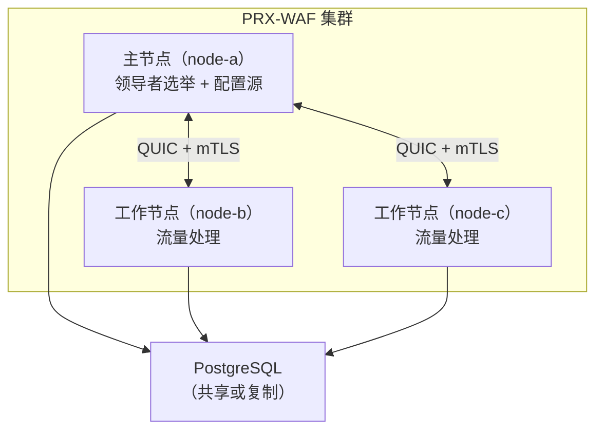

# 集群模式

PRX-WAF 支持多节点集群部署，实现水平扩展和高可用。集群模式使用基于 QUIC 的节点间通信、Raft 风格的领导者选举，以及规则、配置和安全事件在所有节点间的自动同步。

::: info
集群模式完全是可选的。默认情况下，PRX-WAF 以单机模式运行，没有任何集群开销。通过在配置文件中添加 `[cluster]` 节来启用。
:::

## 架构

PRX-WAF 集群由一个 **主节点（main）** 和一个或多个 **工作节点（worker）** 组成：



### 节点角色

| 角色 | 说明 |
|------|------|
| `main` | 持有权威配置和规则集。向工作节点推送更新。参与领导者选举。 |
| `worker` | 处理流量并应用 WAF 流水线。从主节点接收配置和规则更新。将安全事件推送回主节点。 |
| `auto` | 参与 Raft 风格的领导者选举。任何节点都可以成为主节点。 |

## 同步内容

| 数据 | 方向 | 间隔 |
|------|------|------|
| 规则 | 主节点到工作节点 | 每 10 秒（可配置） |
| 配置 | 主节点到工作节点 | 每 30 秒（可配置） |
| 安全事件 | 工作节点到主节点 | 每 5 秒或 100 条事件（以先到达者为准） |
| 统计数据 | 工作节点到主节点 | 每 10 秒 |

## 节点间通信

所有集群通信使用 QUIC（通过 Quinn）在 UDP 上进行，并启用双向 TLS（mTLS）：

- **端口：** `16851`（默认）
- **加密：** mTLS，支持自动生成或预配置证书
- **协议：** QUIC 流上的自定义二进制协议
- **连接：** 持久连接，自动重连

## 领导者选举

当配置 `role = "auto"` 时，节点使用 Raft 风格的选举协议：

| 参数 | 默认值 | 说明 |
|------|--------|------|
| `timeout_min_ms` | `150` | 最小选举超时（随机范围） |
| `timeout_max_ms` | `300` | 最大选举超时（随机范围） |
| `heartbeat_interval_ms` | `50` | 主节点到工作节点的心跳间隔 |
| `phi_suspect` | `8.0` | Phi 累积故障检测器的疑似阈值 |
| `phi_dead` | `12.0` | Phi 累积故障检测器的死亡阈值 |

当主节点不可达时，工作节点在配置范围内的随机超时后发起选举。第一个获得多数票的节点成为新的主节点。

## 健康监控

集群健康检查器在每个节点上运行，监控对等节点的连接状态：

```toml
[cluster.health]
check_interval_secs   = 5    # 健康检查频率
max_missed_heartbeats = 3    # N 次未响应后标记为不健康
```

不健康的节点会被排除在集群外，直到恢复并重新同步。

## 证书管理

集群节点使用 mTLS 证书相互认证：

- **自动生成模式：** 主节点在首次启动时生成 CA 证书并签署节点证书。工作节点在加入过程中接收证书。
- **预配置模式：** 证书在离线状态下生成，启动前分发到每个节点。

```toml
[cluster.crypto]
ca_cert        = "/certs/cluster-ca.pem"
node_cert      = "/certs/node-a.pem"
node_key       = "/certs/node-a.key"
auto_generate  = true
ca_validity_days    = 3650   # 10 年
node_validity_days  = 365    # 1 年
renewal_before_days = 7      # 到期前 7 天自动续签
```

## 下一步

- [集群部署](./deployment) —— 分步多节点搭建指南
- [配置参考](../configuration/reference) —— 所有集群配置项
- [故障排除](../troubleshooting/) —— 常见集群问题
