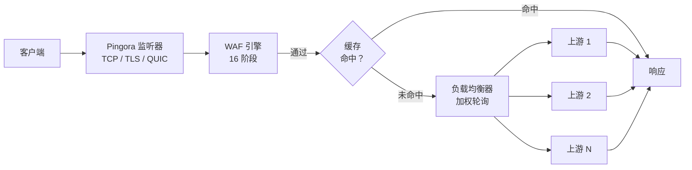

# 网关

PRX-WAF 基于 [Pingora](https://github.com/cloudflare/pingora)（Cloudflare 的 Rust HTTP 代理库）构建。网关处理所有入站流量，将请求路由到上游后端，并在转发前应用 WAF 检测流水线。

## 协议支持

| 协议 | 状态 | 说明 |
|------|------|------|
| HTTP/1.1 | 已支持 | 默认 |
| HTTP/2 | 已支持 | 通过 ALPN 自动升级 |
| HTTP/3（QUIC） | 可选 | 通过 Quinn 库，需配置 `[http3]` |
| WebSocket | 已支持 | 全双工代理 |

## 核心功能

### 负载均衡

PRX-WAF 使用加权轮询算法将流量分发到多个上游后端。每个主机条目可以指定多个上游服务器及其权重：

```toml
[[hosts]]
host        = "example.com"
port        = 80
remote_host = "10.0.0.1"
remote_port = 8080
guard_status = true
```

主机也可以通过管理界面或 REST API（`/api/hosts`）管理。

### 响应缓存

网关包含基于 moka 的 LRU 内存缓存，用于减少上游服务器负载：

```toml
[cache]
enabled          = true
max_size_mb      = 256       # 最大缓存大小
default_ttl_secs = 60        # 缓存响应的默认 TTL
max_ttl_secs     = 3600      # 最大 TTL 上限
```

缓存遵循标准 HTTP 缓存头（`Cache-Control`、`Expires`、`ETag`、`Last-Modified`），并支持通过管理 API 进行缓存失效。

### 反向隧道

PRX-WAF 可以创建基于 WebSocket 的反向隧道（类似 Cloudflare Tunnel），无需开放入站防火墙端口即可暴露内部服务：

```bash
# 列出活跃隧道
curl -H "Authorization: Bearer $TOKEN" http://localhost:9527/api/tunnels

# 创建隧道
curl -X POST -H "Authorization: Bearer $TOKEN" \
  -H "Content-Type: application/json" \
  -d '{"name":"internal-api","target":"http://192.168.1.10:3000"}' \
  http://localhost:9527/api/tunnels
```

### 防盗链

网关支持基于 Referer 的防盗链保护。启用后，没有来自配置域名的有效 Referer 头的请求将被拦截。可在管理界面或通过 API 按主机配置。

## 架构



## 下一步

- [反向代理](./reverse-proxy) —— 详细的后端路由和负载均衡配置
- [SSL/TLS](./ssl-tls) —— HTTPS、Let's Encrypt 和 HTTP/3 设置
- [配置参考](../configuration/reference) —— 所有网关配置项
