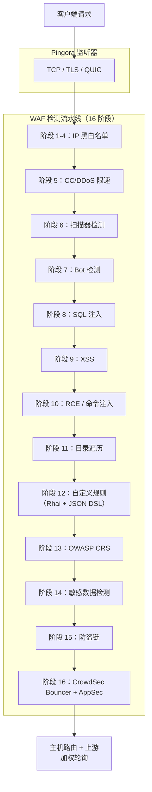

# PRX-WAF

**PRX-WAF** 是一款基于 [Pingora](https://github.com/cloudflare/pingora)（Cloudflare 的 Rust HTTP 代理库）构建的生产级 Web 应用防火墙代理。它将 16 阶段攻击检测流水线、Rhai 脚本引擎、OWASP CRS 支持、ModSecurity 规则导入、CrowdSec 集成、WASM 插件和 Vue 3 管理界面整合到一个可部署的二进制文件中。

PRX-WAF 专为 DevOps 工程师、安全团队和平台运维人员设计，为他们提供一款快速、透明且可扩展的 WAF —— 能够代理数百万请求、检测 OWASP Top 10 攻击、自动续签 TLS 证书、通过集群模式水平扩展，并对接外部威胁情报源 —— 而无需依赖专有的云 WAF 服务。

## 为什么选择 PRX-WAF？

传统 WAF 产品往往是专有的、昂贵的且难以定制。PRX-WAF 采用了截然不同的设计理念：

- **开放可审计。** 每一条检测规则、阈值和评分机制都在源代码中清晰可见。没有隐藏的数据收集，没有供应商锁定。
- **多阶段纵深防御。** 16 个顺序检测阶段确保即使某一阶段漏掉攻击，后续阶段也能捕获。
- **Rust 优先性能。** 基于 Pingora 构建，PRX-WAF 在普通硬件上即可实现接近线速的吞吐量，延迟开销极低。
- **可扩展设计。** YAML 规则、Rhai 脚本、WASM 插件和 ModSecurity 规则导入使 PRX-WAF 能够轻松适配任何应用架构。

## 核心功能

<div class="vp-features">

- **Pingora 反向代理** —— 支持 HTTP/1.1、HTTP/2 和 HTTP/3（通过 QUIC / Quinn）。加权轮询负载均衡。

- **16 阶段检测流水线** —— IP 黑白名单、CC/DDoS 限速、扫描器检测、Bot 检测、SQLi、XSS、RCE、目录遍历、自定义规则、OWASP CRS、敏感数据检测、防盗链、CrowdSec 集成。

- **YAML 规则引擎** —— 声明式 YAML 规则，支持 11 种操作符、12 种请求字段、1-4 级偏执模式，以及无停机热重载。

- **OWASP CRS 支持** —— 310+ 条从 OWASP ModSecurity Core Rule Set v4 转换的规则，覆盖 SQLi、XSS、RCE、LFI、RFI、扫描器检测等。

- **CrowdSec 集成** —— Bouncer 模式（LAPI 决策缓存）、AppSec 模式（远程 HTTP 检查）和日志推送，实现社区威胁情报共享。

- **集群模式** —— 基于 QUIC 的节点间通信、Raft 风格的领导者选举、规则/配置/事件自动同步和 mTLS 证书管理。

- **Vue 3 管理界面** —— JWT + TOTP 认证、实时 WebSocket 监控、主机管理、规则管理和安全事件仪表板。

- **SSL/TLS 自动化** —— 通过 ACME v2（instant-acme）对接 Let's Encrypt，自动证书续签，支持 HTTP/3 QUIC。

</div>

## 架构

PRX-WAF 采用 7 个 Crate 的 Cargo 工作区组织：

| Crate | 职责 |
|-------|------|
| `prx-waf` | 二进制入口：CLI 入口点，服务器引导 |
| `gateway` | Pingora 代理、HTTP/3、SSL 自动化、缓存、隧道 |
| `waf-engine` | 检测流水线、规则引擎、检查器、插件、CrowdSec |
| `waf-storage` | PostgreSQL 层（sqlx）、迁移、模型 |
| `waf-api` | Axum REST API、JWT/TOTP 认证、WebSocket、静态 UI |
| `waf-common` | 共享类型：RequestCtx、WafDecision、HostConfig、配置 |
| `waf-cluster` | 集群共识、QUIC 传输、规则同步、证书管理 |

### 请求处理流程



## 快速安装

```bash
git clone https://github.com/openprx/prx-waf
cd prx-waf
docker compose up -d
```

管理界面：`http://localhost:9527`（默认账号：`admin` / `admin`）

完整安装方法（包括 Cargo 安装和源码编译）请参阅[安装指南](./getting-started/installation)。

## 文档目录

| 章节 | 说明 |
|------|------|
| [安装](./getting-started/installation) | 通过 Docker、Cargo 或源码编译安装 PRX-WAF |
| [快速开始](./getting-started/quickstart) | 5 分钟内让 PRX-WAF 保护你的应用 |
| [规则引擎](./rules/) | YAML 规则引擎工作原理 |
| [YAML 语法](./rules/yaml-syntax) | 完整的 YAML 规则模式参考 |
| [内置规则](./rules/builtin-rules) | OWASP CRS、ModSecurity、CVE 补丁 |
| [自定义规则](./rules/custom-rules) | 编写自定义检测规则 |
| [网关](./gateway/) | Pingora 反向代理概述 |
| [反向代理](./gateway/reverse-proxy) | 后端路由与负载均衡 |
| [SSL/TLS](./gateway/ssl-tls) | HTTPS、Let's Encrypt、HTTP/3 |
| [集群模式](./cluster/) | 多节点部署概述 |
| [集群部署](./cluster/deployment) | 分步集群搭建指南 |
| [管理界面](./admin-ui/) | Vue 3 管理仪表板 |
| [配置](./configuration/) | 配置概述 |
| [配置参考](./configuration/reference) | 所有 TOML 配置项详细文档 |
| [CLI 参考](./cli/) | 所有 CLI 命令和子命令 |
| [故障排除](./troubleshooting/) | 常见问题与解决方案 |

## 项目信息

- **许可证：** MIT OR Apache-2.0
- **语言：** Rust（2024 edition）
- **仓库：** [github.com/openprx/prx-waf](https://github.com/openprx/prx-waf)
- **最低 Rust 版本：** 1.82.0
- **管理界面：** Vue 3 + Tailwind CSS
- **数据库：** PostgreSQL 16+
