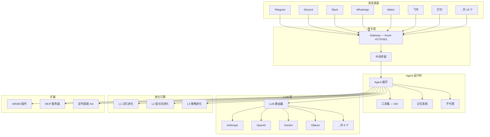

# PRX — 自进化 AI 助手框架

PRX 是一个用 Rust 从零构建的 **自进化 AI 助手框架**（177K LOC），旨在成为你跨所有通讯平台的统一 AI 助手基座。它不只是一个聊天机器人 —— 它是一个完整的 Agent 运行时，能够自主学习、记忆、推理、行动，并随着使用不断进化。

## 为什么选择 PRX

现有的 AI 助手方案普遍面临三个问题：

1. **平台碎片化** — 每个聊天平台都要写一套 bot，逻辑分散、维护成本高
2. **能力封闭** — 大多数方案只是 LLM 的薄封装，无法扩展工具、记忆和行为
3. **静态不进化** — 部署后行为固定，无法根据用户反馈和使用模式自我改进

PRX 通过统一的 Agent 架构、插件化设计和三层自进化系统解决了这些问题。

## 核心特性

### 19 个消息渠道

一次配置，覆盖 Telegram、Discord、Slack、WhatsApp、Signal、iMessage、Matrix、飞书、钉钉、邮件、IRC、Mattermost 等 19 个平台。支持私聊、群聊、媒体消息和语音。

### 9 个 LLM 提供商

内置 Anthropic (Claude)、OpenAI、Google Gemini、GitHub Copilot、Ollama、AWS Bedrock、GLM（智谱）、OpenAI Codex、OpenRouter 支持，以及任何 OpenAI 兼容端点。通过 LLM 路由器自动选择最优模型。

### 46+ 内置工具

Shell 执行、浏览器自动化、文件操作、网页搜索、HTTP 请求、Git 操作、定时任务、消息发送、MCP 集成等。每个工具都经过沙箱隔离和策略引擎审核。

### 三层自进化系统

- **L1 记忆进化** — 自动整理、归纳和优化长期记忆
- **L2 提示词进化** — 根据对话效果自动调优系统提示词
- **L3 策略进化** — 自主发现并优化行为策略，带安全回滚

### WASM 插件系统

基于 WebAssembly Component Model 的插件架构，支持 6 种插件类型（工具/中间件/钩子/定时/提供商/存储），47 个宿主函数，完整的 PDK 开发套件。

### 生产级安全

策略引擎、4 种沙箱后端（Docker/Firejail/Bubblewrap/Landlock）、ChaCha20 加密密钥存储、配对认证、速率限制、4 级安全自治模式。

## 架构总览



## 快速安装

```bash
# 一键安装（推荐）
curl -fsSL https://get.openprx.dev | bash

# 或通过 cargo 安装
cargo install openprx

# 验证
prx --version
```

安装完成后，运行引导向导：

```bash
prx onboard
```

详细安装步骤请参阅 [安装指南](./getting-started/installation)。

## 文档导航

| 章节 | 说明 |
|------|------|
| [安装](./getting-started/installation) | 多种安装方式、平台说明 |
| [快速开始](./getting-started/quickstart) | 5 分钟从零到对话 |
| [引导向导](./getting-started/onboarding) | `prx onboard` 详解 |
| [消息渠道](./channels/) | 19 个渠道的配置与使用 |
| [LLM 提供商](./providers/) | 9 个提供商的接入方式 |
| [工具](./tools/) | 46+ 内置工具文档 |
| [记忆系统](./memory/) | 4 种存储后端与向量搜索 |
| [自进化](./self-evolution/) | L1/L2/L3 三层自进化系统 |
| [插件 (WASM)](./plugins/) | WebAssembly 插件开发指南 |
| [安全](./security/) | 策略引擎、沙箱、密钥管理 |
| [配置参考](./config/) | 完整配置项说明 |
| [CLI 参考](./cli/) | 所有命令行命令详解 |

## 项目信息

- **语言**: Rust (2024 edition)
- **代码量**: 177,000+ 行
- **许可证**: MIT + Apache-2.0 双许可
- **仓库**: [github.com/openprx/prx](https://github.com/openprx/prx)
- **组织**: [OpenPRX](https://github.com/openprx)
